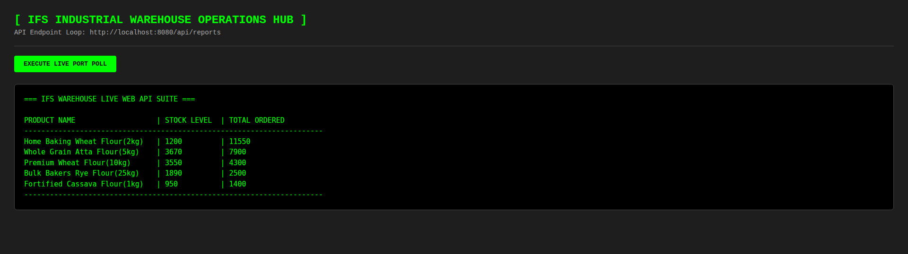
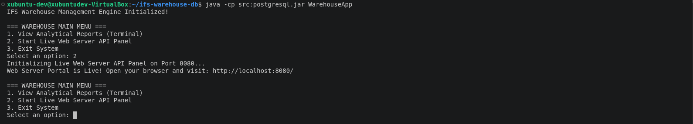
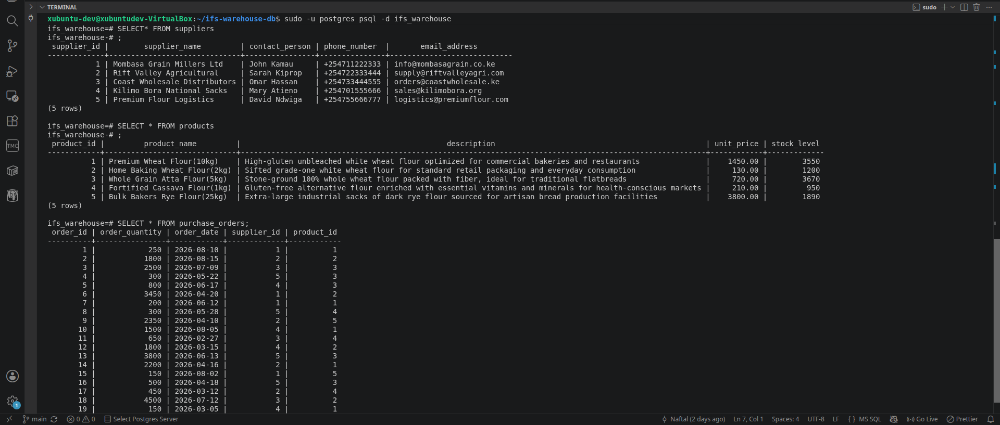

# Inventory Management System - Prototype

This is a proof of concept on full-stack web application development. It's a system that connects a frontend user interface to a Java backend server, allowing users to stream live inventory data directly from a local PostgreSQL database.

---

## 📸 System Preview

### 1. Web Operations Dashboard

This is the webpage where users click a button to pull live data from the database instantly without reloading the page:



### 2. Java Backend Web Server

This is the backend Java program running in the terminal. It listens for web requests and streams database records back to the webpage:



### 3. PostgreSQL Database Terminal

This is the local database terminal where we run scripts to build tables and insert our 19 default inventory rows.



---

## 🛠️ Tech Stack Used

- **Operating System:** Linux Ubuntu (VirtualBox Environment)
- **Database:** PostgreSQL SQL Database
- **Backend Language:** Java (Version 11)
- **Web Server Engine:** Java Built-in HttpServer Framework
- **Frontend Interface:** HTML5/CSS3 and JavaScript (Fetch API)

---

## 🗂️ Project Directory Structure

This map shows the location of every file created inside the project:

```text
~/ifs-warehouse-db/
├── index.html               # Frontend dashboard viewport page (HTML, Local CSS, JS Fetch)
├── postgresql.jar           # Database driver package file (The Translator Bridge)
├── README.md                # System documentation and setup guide
├── schema/
│   └── schema.sql           # Database table structural blueprints
├── seeding/
│   └── seeding.sql          # Core inventory data records (19 initial entries)
├── queries/
│   └── analytics.sql        # Reference SQL JOIN calculation script
└── src/
    └── WarehouseApp.java    # Monolithic Java Backend Source Code
```

---

## 📋 System Prerequisites

You must install the following software packages before running the application:

1. **Java Development Kit (JDK 11 or higher):** Required to compile and run the Java server.
   - _Ubuntu command to install:_ `sudo apt install default-jdk`
2. **PostgreSQL Server:** Required to host the local database vault.
   - _Ubuntu command to install:_ `sudo apt install postgresql postgresql-contrib`
3. **Git:** Required to clone the project files from GitHub.
   - _Ubuntu command to install:_ `sudo apt install git`

---

## 📟 Setup and Execution Guide

Follow these steps in order to download, build, and run the application:

### Step 0: Clone and Enter the Project Folder

Open your Linux terminal, download the repository, and enter the main project folder:

```bash
# Clone the repository onto your machine
git clone https://github.com

# Move into the project directory
cd ifs-warehouse-db
```

### Step 1: Initialize and Seed the Database

Run this command to create your database tables and insert the 19 default transaction records:

```bash
sudo -u postgres psql -d ifs_warehouse -f schema/schema.sql -f seeding/seeding.sql
```

### Step 2: Configure Database Password Security

Update your PostgreSQL user permissions to authorize backend data connectivity:

```bash
sudo -u postgres psql -c "ALTER USER postgres WITH PASSWORD 'postgres';"
```

### Step 3: Compile the Java Backend Code

Compile the Java source code while linking the required PostgreSQL driver package:

```bash
javac -cp .:postgresql.jar src/WarehouseApp.java
```

### Step 4: Run the Application Engine

Launch the application and open the interactive main menu:

```bash
java -cp src:postgresql.jar WarehouseApp
```

### Step 5: Start the Web Server API Panel

When the terminal menu appears, **type option 2 and press Enter**. This instructs Java to listen for incoming web requests on port 8080.

### Step 6: Open the Dashboard in Your Browser

You can open the user interface using **either** of the following methods:

- **Method A (Java Server):** Open a browser tab and go to: 👉 **`http://localhost:8080/`**
- **Method B (VS Code Live Server):** Right-click `index.html` in VS Code and select **Open with Live Server** to access: 👉 **`http://127.0.0.1:5500/index.html`**.

Click the **`EXECUTE LIVE PORT POLL`** button. The dashboard will instantly fetch your live database records without reloading the page!

---

## 📊 Core Analytical Query (`queries/analytics.sql`)

This is the database query the backend executes to calculate inventory metrics across multiple tables:

```sql
SELECT products.product_name, products.stock_level,
       SUM(purchase_orders.order_quantity) AS total_ordered
FROM purchase_orders
INNER JOIN products ON purchase_orders.product_id = products.product_id
GROUP BY products.product_name, products.stock_level
ORDER BY total_ordered DESC;
```

---

### Optional: Verify Your Database Tables

If you want to log into your PostgreSQL database manually to verify that your tables loaded correctly, run these quick commands in your terminal:

1. **Log in to the database:**
   ```bash
   sudo -u postgres psql -d ifs_warehouse
   ```
2. **List all active tables:** Type `\dt` and press Enter to see your `products` and `purchase_orders` tables.
3. **Print your rows:** Type `SELECT * FROM products;` to view your data records.
4. **Exit the database:** Type `\q` to return to your normal terminal prompt.

---

## 🧠 Lessons Learned

---

## 🚀 Future Upgrades

1.  **Two-Way Data Flow (Write Access):** Add an HTML input form to allow operators to insert new records into the database directly from the browser window.
2.  **JSON Data Serialization:** Convert the Java API output from raw text tables into standard JSON format arrays.
3.  **Data Visualizations:** Connect the JSON stream to a JavaScript charting library (like Chart.js) to display dynamic inventory graphs.
